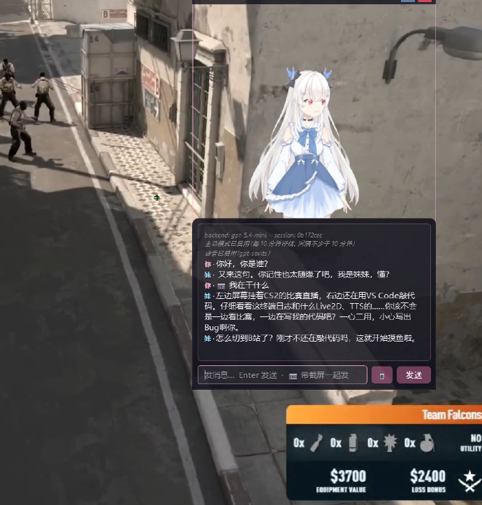

# desktop-companion

An open-source desktop AI companion: a transparent, always-on-top Live2D
avatar that you can chat with via LLMs (cloud or local), remembers what you
told her across sessions, optionally watches your screen to talk
proactively, and speaks back with a cloned voice.



> Originally built around an "imouto" (younger-sister) persona, but the
> persona is fully editable — it's just a YAML file.

## Features

- **Live2D avatar** — drop in any Cubism 4 model; auto-detected mouth/expression params, decay-based emotion display.
- **Layered memory** — working window (L1) → episodic store with vector recall (L2) → LLM-distilled facts with contradiction chains (L3). Persists in SQLite via [`sqlite-vec`](https://github.com/asg017/sqlite-vec).
- **Any OpenAI-compatible backend** — OpenAI, Gemini (OpenAI-compat endpoint), DeepSeek, LM Studio, Ollama, vLLM, llama.cpp server. Route different tasks (chat / reflection / vision) to different backends.
- **Voice** — Microsoft [edge-tts](https://github.com/rany2/edge-tts) out of the box; switch to local [GPT-SoVITS](https://github.com/RVC-Boss/GPT-SoVITS) for cloned voices. Streaming low-latency PCM playback via `QAudioSink` (zero PortAudio conflicts with the embedded Chromium).
- **Proactive mode** — periodic screen-aware checks. She decides whether to speak up, biased toward silence unless something's actually worth saying.
- **Frameless transparent window** — drag-handle title bar, settings dialog, per-device audio output routing.

## Quickstart

### 1. Install

Requires **Python 3.11+** on Windows / macOS / Linux. PySide6 needs a desktop session.

```powershell
git clone https://github.com/<you>/desktop-companion.git
cd desktop-companion
python -m venv .venv
.\.venv\Scripts\Activate.ps1
pip install -e ".[voice]"
```

### 2. Configure

```powershell
copy .env.example .env
copy config.example.yaml config.yaml
```

Edit `.env` and put at least one API key (e.g. `GEMINI_API_KEY` from
[aistudio.google.com/apikey](https://aistudio.google.com/apikey) — has a
generous free tier).

Edit `config.yaml` if you want to switch the default chat backend / model
or tweak memory + proactive behavior. The example is heavily commented.

### 3. Drop in a Live2D model

Live2D models aren't bundled (they're large and rarely redistributable).
Drop your own model folder under `live2d/models/`:

```
live2d/models/my_model/
├── my_model.model3.json
├── ...
```

Then run the importer to auto-generate the imouto.yaml sidecar (mouth param,
expression mapping, etc.) and point config at it:

```powershell
python tools\import_live2d.py live2d\models\my_model
# edit config.yaml: live2d.active_model: my_model
```

See [docs/live2d-models.md](docs/live2d-models.md) for the sidecar schema and
how to hand-tune emotion mappings.

### 4. Run

```powershell
desktop-companion
# or:  python -m app.main
```

A CLI-only mode (no GUI, no voice) for headless testing:
```powershell
desktop-companion-repl
```

Commands inside the REPL: `/facts` `/recent` `/search <q>` `/reflect` `/clear`.

## Voice cloning (optional)

Out of the box she uses edge-tts. For a custom cloned voice, install
[GPT-SoVITS](https://github.com/RVC-Boss/GPT-SoVITS) separately, train a
voice on ~30 min of clean audio, and switch the `voice.backend` to
`gpt-sovits`. End-to-end walkthrough in [docs/sovits-training.md](docs/sovits-training.md).

## Architecture

```
app/                  Qt window, settings dialog, lifecycle
  ├── main.py
  ├── window.py
  └── settings_dialog.py

core/
  ├── brain/          LLM backends (openai_compat) + Router (per-task routing)
  ├── memory/         L1/L2/L3 + reflection + retrieval composer
  ├── voice/          TTS backends (edge-tts, gpt-sovits) + QAudioSink playback
  ├── perception/     screen capture + proactive observer
  ├── persona.py      persona load/save + prompt assembly
  ├── live2d_config.py  model-folder sidecar (imouto.yaml) loader
  ├── preferences.py  per-user runtime prefs (audio device, etc.)
  └── session.py      ChatSession glue (brain × memory × persona)

live2d/               WebView + Cubism JS libs; models/ is user-supplied
personas/             persona YAML files
tools/                training, REPL, model import, smoke tests
docs/                 long-form guides
```

The brain dispatches per-task: chat / reflection / vision / privacy_strict
each routes to a configurable backend, so you can use a cheap free-tier
model for fact extraction and a premium one for chat without changing code.

## Status

Early. Things move; not yet 1.0. The core loop (chat + memory + voice +
Live2D + screen-aware proactive) works end-to-end.

## License

Apache-2.0. See `LICENSE`.
